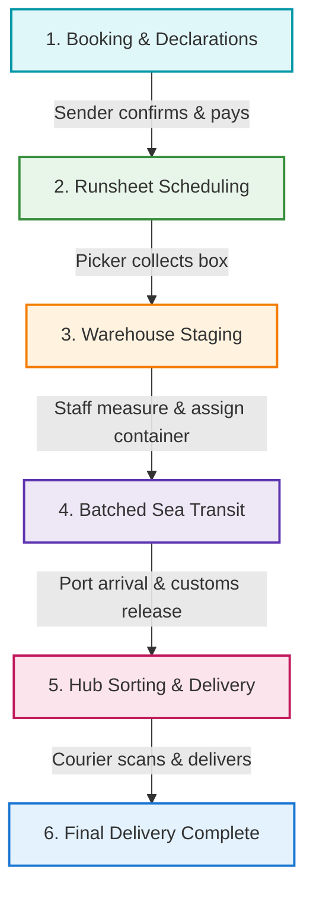

# 📦 Eagle Cargo App — Feature Documentation

Welcome to the technical feature documentation for the **Eagle Cargo App**. This app is a comprehensive logistics, booking, and tracking platform tailored for Eagle Cargo Company cargo and freight operations. 

This documentation details the core operational features, business rules, and technical architectures of the application.

---

## 🗺️ Operational Flow Overview

The logistics lifecycle is divided into six distinct stages. From sender booking and digital item declarations, to runsheet pickup, warehouse validation, container consolidation, maritime transit, and last-mile courier delivery:

---

## 📂 Feature Documentation Modules

Click on any of the modules below to view detailed technical specifications, database schema interactions, business logic rules, and integration details:

| Module | Core Features Covered | Main Files & Classes |
| :--- | :--- | :--- |
| **[1. Booking & Digital Declarations](./features/FEATURES.md#booking--declaration-system)** | Booking Draft Auto-Saving, Booking Cloning, Recipient Autocomplete, Items Custom Declarations, Dynamic PDF Generator | `BookingController.php` `BookingRepository.php` `Booking.php` |
| **[2. Invoicing, Payments & Zoho Books](./features/FEATURES.md#payments--invoicing)** | VAT Calculations, Stripe Card Payments, Proof-of-Payment Uploads, Point-in-time Snapshots, Zoho Books Integration | `Invoice.php` `PaymentService.php` `ZohoService.php` `TransactionSnapshotService.php` |
| **[3. Operational Runsheets & Tracking](./features/FEATURES.md#runsheets--driver-operations)** | Pickup & Delivery Runsheet Assignation, Area Eligibility Constraints, Stops Sequencing, Mobile Scan Workflows | `RunsheetService.php` `PickerController.php` `CourierController.php` `BoxStatusChanged.php` |
| **[4. Warehouse Consolidation & Batches](./features/FEATURES.md#warehouse-consolidation--batches)** | Barcode Check-in, Physical Weight & CBM Updates, Container (Batch) Capacity Constraints, Next-Batch Rollings | `WarehouseController.php` `BatchService.php` `BatchRepository.php` `Batch.php` |
| **[5. Data Integrity Exception Auditor](./features/FEATURES.md#data-integrity--exception-auditing)** | Missing Customs Declarations, Orphan Warehouse Packages, SLA Dwell-time Breaches, Automated Mitigation & Auditing | `DataIntegrityService.php` `DataIntegrityController.php` `DataIntegrityWarning.php` |

> [!TIP]
> Looking for a high-level overview of all platform capabilities? See the **[📋 Marketing Feature Overview](./features/FEATURES.md)** for a comprehensive, non-technical summary of every feature.

---

## 🧱 Key System Roles & Portals

The application features a granular role-based authorization model (`app/Enums/Role.php`) controlling access to specialized portals:

*   **👥 Senders**: Access the customer booking dashboard, create drafts, make Stripe payments, upload payment receipts, and declare contents.
*   **🚚 Pickers**: On-the-road collections agents who manage runsheets, record cash/check payments, scan package barcodes, and upload physical declaration photos.
*   **🚲 Couriers**: Last-mile delivery drivers who handle regional dispatch sheets, execute drops, and verify delivery completion.
*   **📦 Warehouse Staff**: Process items received at the warehouse/facility, verify weight/measurements, pack/unpack boxes into sea container Batches, and record damage or administrative holds.
*   **👑 Admins / Super Admins**: Oversee area pricing rules, financial reports, system audits (Data Integrity), user roles, and dispatch logs.
*   **🤝 Recipients**: Public tracking page to view shipment stages, carrier updates, and expected delivery milestones.

---

> [!NOTE]
> All tracking status changes automatically trigger real-time multi-channel updates (Email, Brevo SMS, WebSockets, In-App Notifications) depending on user-configured preferences.
